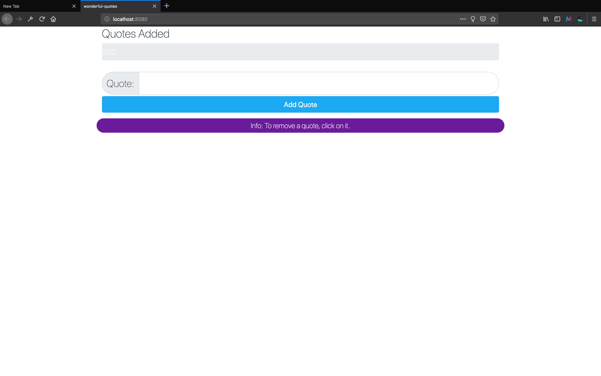
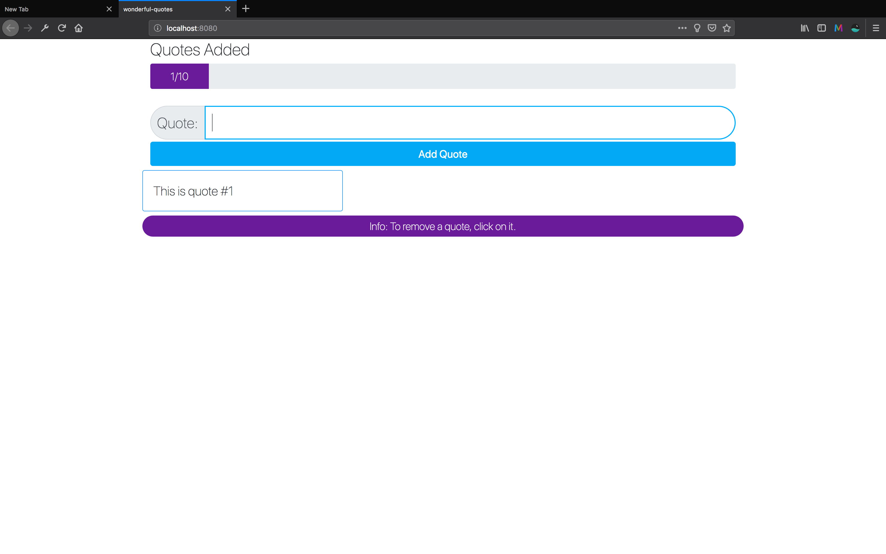
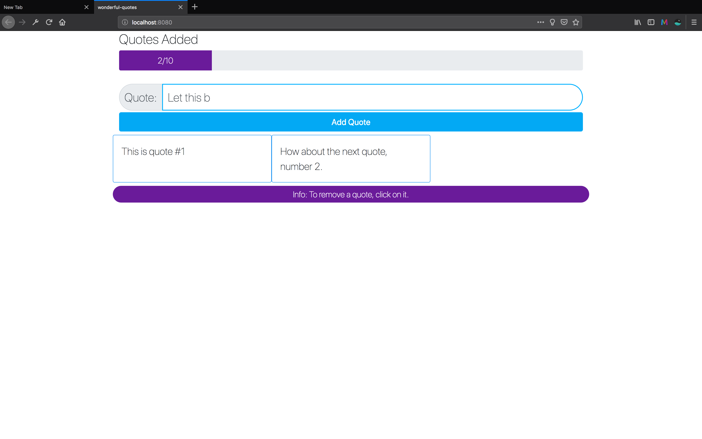
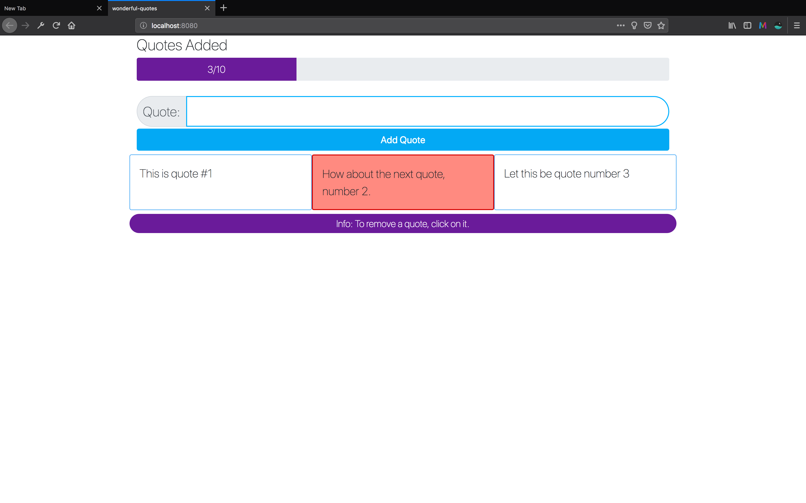
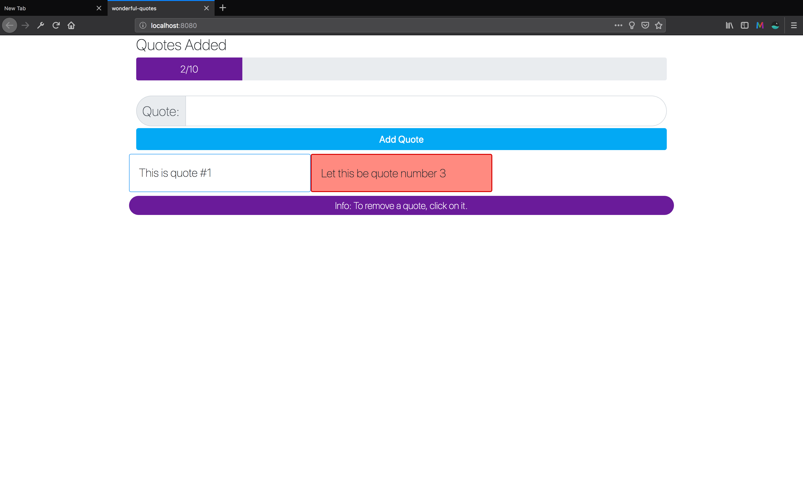
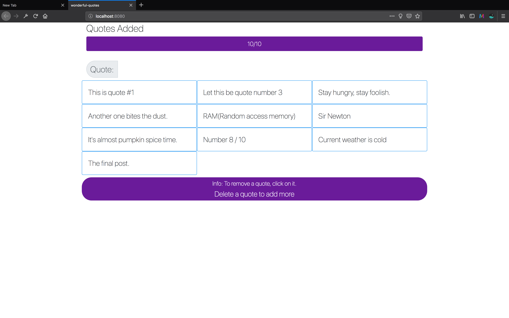
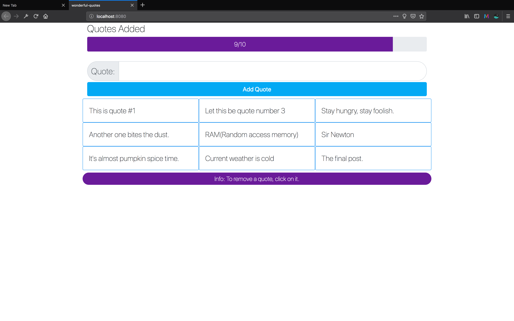

# wonderful-quotes

> The second course project in Vue JS 2 - The Complete Guide (incl. Vue Router & Vuex) on Udemy

## Build Setup

``` bash
# install dependencies
npm install

# serve with hot reload at localhost:8080
npm run dev

# build for production with minification
npm run build
```

For detailed explanation on how things work, consult the [docs for vue-loader](http://vuejs.github.io/vue-loader).

## Project Images
> Landing Page, this is what the user sees when they first load the page.


> Entering your first quote.


> Adding more than one quote.


> Removing a quote, notice how you can select by clicking on which quote you want to remove(red).



> Once the user has hit the limit of 10 quotes, one must me deleted.




